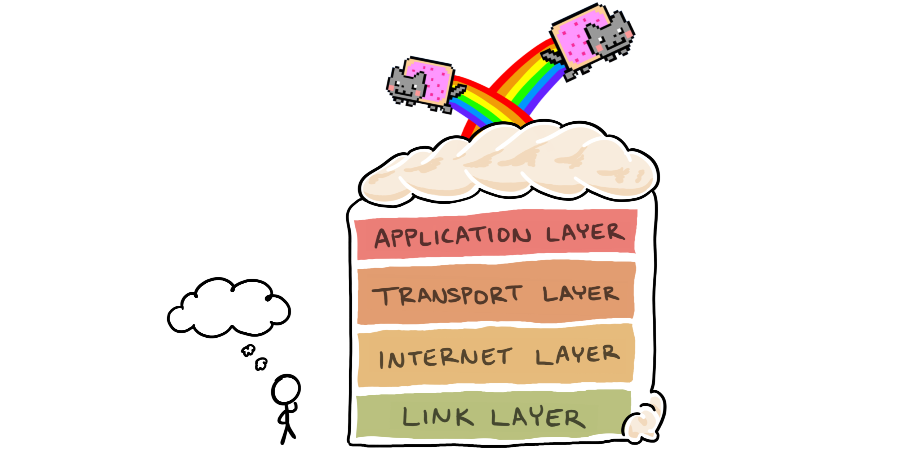

#### Q1. What is a protocol stack, and how is it used in web development?

---

####Protocol stack also known as network stack works to enable communication between devices over a network and use for data transmission and exchange.

##### The main purpose of protocol stack is to ensure that data can transmitted reliably and efficiently across the network regardless of devices and operating system involved.

######The most well-known and widely used protocol stack in web development is TCP/IP stack, which includes the HTTP protocol at application layer

- Transmission Control Protocol/ Internet Protocol
- Hypertext Transfer Protocol

---

1. **Client-server communication:** When a user interact with a web browser and request a web page or send data, the client sends an HTTP request to the server

1. **Application layer:** The HTTP protocol, which operates at the application layer handles the client request and DNS is been called to provide the correct IP of that domain.

1. **Transport Layer:** Once the HTTP request is formed, now the most commonly used protocol TCP ensure the reliable and ordered data delivery between client and server

1. **Network layer:** At this layer the routing of data packets across various network IP protocol is primary used in this layer.
   also the IP address of both client and server is attached here

1. **Link Layer:** Data link layer deals with protocol like Ethernet or wifi depending on the type of connection

1. **Physical Layer:** The data here starts transmitting in bit by bit over the network and reaches the sever

####Then server revive the request unpack it and returns the response in the same manner following all the layers and it receives at the client and it is how the data transmit over the internet.
