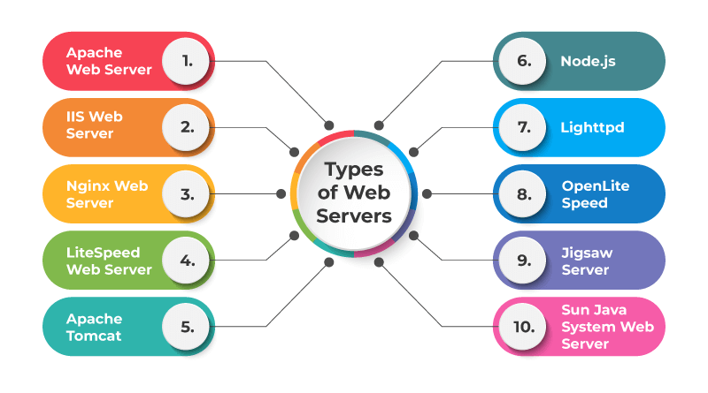

## ####What are the different types of web servers, and how do they differ in terms of functionality and performance?

---

#####There are several types of web servers, each with its own characteristics, here are some of most common types of web servers:

1. ** Apache HTTP server:** Apache is one of the oldest and most widely used web server. It is open-source cross platform and highly configurable. Apache supports wide range of operating system and is knows for its stability.

1. **NginX (Engine-x):** It is a lightweight, high-performance web server and reverse proxy server.
   It is popular in front-end proxy server to distribute incoming request to backend server. make it suitable for website with high traffic

1. **Microsoft IIS:** Internet Information services is primarily used on windows server OS. It provides robust support ASP.net app and also support PHP and other languages

1. **Tomcat:** Apache Tomcat is application server that serves the Java based web apps it is used to run javaServer and can handle java based framework

1. **Node.js:** While not a traditional web server, Node is a popular JavaScript runtime that allows developer to build server-side application. It uses an event-driven, non-blocking server I/O model, making it will suited for real-time application, chat app and streaming services

1. **The best choice depends on specific application needs and expected traffic. Benchmarking helps determine the most suitable server**
